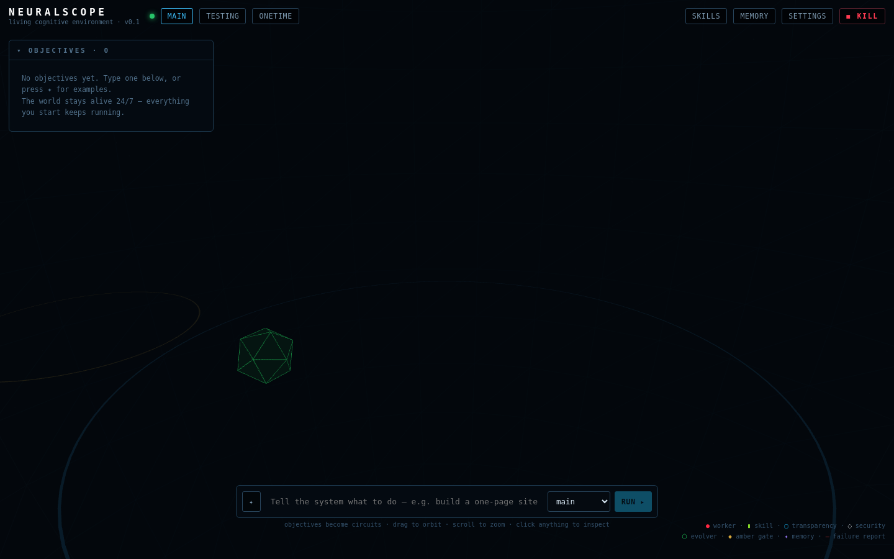

# NeuralScope

**A living cognitive environment.** NeuralScope is a self-improving multi-agent
work system you watch — and shape — inside a 3D world. You type an objective in
plain language; an Engine on your machine compiles it into a flight plan, boots
teams of AI workers through validated pipelines, delivers real files, learns
from every run, and rewrites its own skill manuals when the evidence says it
should. The 3D World is a live window into all of it: every sphere, slab and
thread on screen is a real, running thing.

> The Engine does all the work. The World only renders. Nothing on screen is invented.


*Live capture: three completed circuits, the green Evolver, and the ticker reading
"★ EVOLVED: skill:frontend → v2" — the system improving itself on real evidence.*

### 📖 Manuals

| Guide | For |
|---|---|
| **[Download & Install Guide](docs/DOWNLOAD-GUIDE.md)** | getting it onto Windows / Mac / Linux in two minutes |
| **[Operating Manual](docs/OPERATING-MANUAL.md)** | driving the app, panel by panel, action by action |
| **[Features Manual](docs/FEATURES.md)** | everything it can do, honestly scoped |
| **[The Eight Systems](docs/eight-systems.md)** | the engineering detail and how each is proven |
| **[Security Model](SECURITY.md)** | tiers, rings, the kill switch, and honest limits |

---

## Download & run (the easy way)

Grab the installer for your OS from the **[Releases page](../../releases)**:

| OS | File |
|---|---|
| Windows | `NeuralScope-x.y.z-win-x64.exe` (one-click installer) |
| macOS | `NeuralScope-x.y.z-mac-arm64.dmg` (Apple Silicon) / `-x64.dmg` (Intel) |
| Linux | `NeuralScope-x.y.z-linux-x64.AppImage` or `.deb` |

Open it. That's the whole setup. NeuralScope works **immediately, fully
offline**, on its built-in demo engine — file an objective and watch the entire
pipeline run: planning, parallel workers, validation catching failures,
retries, delivery, and evolution. No accounts, no keys, no telemetry.

> Maintainer note: installers are produced by the `release.yml` workflow — push a
> tag like `v0.1.0` and GitHub builds and attaches all six artifacts automatically.

### Your first five minutes

1. **File an objective.** Press <kbd>✦</kbd> in the command bar for examples, or type:
   `Build a one-page website for a cozy bakery called Amber Crumb` → **RUN ▸**
2. **Watch the circuit grow.** The compiled plan IS the structure: step nodes,
   green skill slabs, blue scaffold rays, a white security orbiter, a turquoise
   transparency frame. Click anything to inspect it; open the **black box
   trace** to read every prompt and validation.
3. **Open the result.** When the circuit settles, hit **open the result ▸** —
   real files, on your real disk.
4. **Watch it learn.** Run the `[demo-fail]` example: the first build attempt
   ships broken on purpose, validation catches it, the retry fixes it, and a
   red thread files a failure report. Then click the green giant → **RUN
   EVOLUTION CYCLE NOW**: it replays the recorded failure against mutated
   skill rewrites in Testing and promotes the winner to v2. That is the
   self-evolving loop, end to end, on your machine.
5. **The kill switch.** The red **◼ KILL** button (or <kbd>Ctrl/Cmd-Shift-K</kbd>)
   freezes every worker and closes every gate instantly. Yours alone.

### Give it real brains (optional, recommended)

The demo engine proves the machinery; real models do real work. In **SETTINGS**:

- **Local models (free, private):** install [Ollama](https://ollama.com), run
  `ollama pull llama3.2` (and `ollama pull qwen2.5-coder` for better builds).
  NeuralScope auto-detects it; worker profiles route to the best installed model.
- **Frontier planning:** paste an Anthropic API key. It is stored encrypted in
  the local vault, never broadcast, never placed inside a prompt. The planner
  and the evolver's mutation step get dramatically sharper.

Mix freely: frontier planner + local workers is the intended sweet spot.

---

## Run from source

```bash
npm install
npm run build      # engine + desktop shell + 3D world
npm run app        # desktop app
# — or headless: —
npm run engine     # prints http://127.0.0.1:43117 — open it in any browser
npm run smoke      # end-to-end proof: plan → fail → retry → deliver → evolve → kill/resume
```

`npm run dist` packages installers for your current OS into `release/`.

## How it works (60 seconds)

```
 World (three.js)  ←  one WebSocket: events up, commands down  →  Engine (Node)
                                                                    │
   Tower      objective compiler · scheduler (parallel DAG) · governor budgets
   Runtime    workers = model + skills + scoped tools + timeout, disposable
   Scaffold   deterministic code: parse → act → VALIDATE → retry → re-ground
   Security   ring 1 tool gatekeeping · ring 2 drift reboots · ring 3 amber
              gates (tier A/B/C/D) · global kill switch  — never evolvable
   Memory     episodic summaries that decay when unused; recalled into planning
   Evolver    capture worst skill → mutate → trial on recorded failures in
              Testing → promote only a proven winner → versioned, reversible
```

Every action emits one contract-validated event (`definitions/schema/events.v1.json`,
frozen); the World maps each event to one animation. Five layers, and no layer
ever skips a layer — enforced by a build-time checker, not convention.

The eight load-bearing systems (content-addressed blobs, canary evolution
with auto-rollback, the autonomy graduation ledger, stats-steered capture,
the enforced layer law, the Google Docs gate, the small-model recovery
ladder, recurring circuits) are documented system-by-system — with how the
smoke test proves each — in [`docs/eight-systems.md`](docs/eight-systems.md).

**Everything is a file you can read.** Skills are markdown in
`~/.neuralscope/definitions/skills/` (edit them live — in the app or any
editor). Events append to `state/events.jsonl` (the black box). Outputs land in
`workspaces/<env>/<objective>/`. Secrets sit encrypted in `vault/`. Delete the
folder and the world is factory-new.

## The three territories

| | |
|---|---|
| **MAIN** | permanent, accumulating: completed circuits persist, memory persists, evolution compounds |
| **TESTING** | the hangar: evolver candidates compete against recorded reality; writes are confined here |
| **ONE-TIME** | charter flights: deliver the output, keep no memory, dissolve |

## Security model (the short version)

Graded autonomy, earned not granted — see [SECURITY.md](SECURITY.md) for the
full tiers, rings, no-go map and honest limits. Highlights: workers never
touch connectors directly (trusted scaffold code does, behind allow-lists);
file writes are hard-scoped to each objective's workspace; web access is
GET-only against your allow-list, anything else pauses at an amber gate for
your click; the kill switch freezes everything instantly; and the security
layer itself is **never** evolvable.

## Project layout

```
engine/        the Engine: tower/ (orchestrator) · runtime/ (workers, validators)
               connectors/ (filesystem, web) · models/ (demo, ollama, anthropic)
world/         the 3D World (three.js + React) — renders events, sends commands
desktop/       thin Electron shell (boots the Engine in-process)
definitions/   factory skills, model profiles, connector manifests, the frozen
               event schema — seeded to ~/.neuralscope on first boot
scripts/       build, icon generator, end-to-end smoke test
docs/          the master blueprint, engineering decisions, the vision board
reference/     the Python embodiment cluster (eyes/hands) — future Tier-D
               connector, dry-run only, NOT wired in
```

## Roadmap

The blueprint's phases (see `docs/neuralscope-blueprint.html`): hardened
recurring circuits → Google Docs connector (OAuth) + browser automation →
multi-day projects and capability graduations (C→B) → the company you monitor.
The honest physics section of the blueprint applies: autonomy is earned with
receipts, ~99% is the design ceiling, and the last 1% is a door we keep a hand on.
